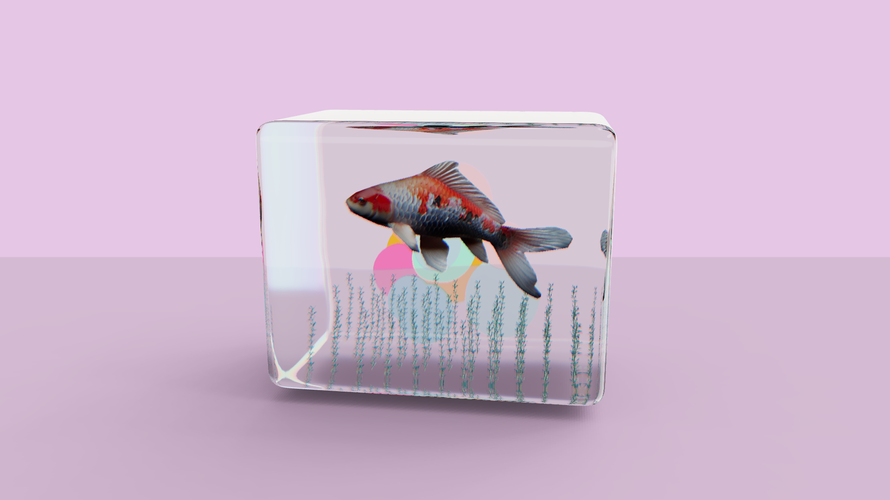

# 3D Mini Aquarium

A calming 3D **mini-aquarium** experience built with **React Three Fiber**, **Three.js**, and **drei**. Features animated **koi fish**, swaying **water plants**, and a refractive **glass aquarium** using `MeshTransmissionMaterial`. Includes dynamic **lighting**, soft **shadows**, and a fully **responsive overlay UI** for a refined and immersive WebGL scene.

[](https://mini-aquarium.vercel.app/)

---

## ✨ Features

* 🐠 **Animated Koi Fish** with swimming motion using GLTF animations
* 🌿 **Swaying Water Plants** using skinned mesh bone animations
* 💧 **Glass Aquarium** with realistic refraction via `MeshTransmissionMaterial`
* 🫧 **Floating Bubbles** rendered via `Instances` and animated with `Float`
* 💡 **Dynamic Lighting** with `Lightformer`, soft **Accumulative Shadows**, and environment lighting
* 🖱️ **Camera Controls** for smooth navigation via `CameraControls`
* ⚡ **Optimized WebGL Scene** using `useMemo`, `Suspense`, and lazy-loading
* 🎯 **Responsive Overlay UI** with media query breakpoints for all screen sizes

---

## 🧠 How It Works

* Loads GLTF models (`koi.glb`, `water_plant.glb`, and `shapes-transformed.glb`) using `useGLTF`
* Plays skinned animations (e.g., plant sway) using `useAnimations` and `useFrame`
* Refractive glass uses `MeshTransmissionMaterial` with distortion and iridescence
* Floating bubbles are rendered with `<Instances>` and animated using `<Float>`
* Scene lighting includes **HDR environment**, **Lightformers**, and **Accumulative Shadows**
* Camera locked to top-down dolly using `CameraControls`

---

## 🛠️ Built With

* [**React Three Fiber**](https://docs.pmnd.rs/react-three-fiber) – Declarative Three.js for React
* [**Three.js**](https://threejs.org/) – Core 3D rendering engine
* [**@react-three/drei**](https://github.com/pmndrs/drei) – Helpers like `useGLTF`, `Float`, `Environment`, `CameraControls`
* [**GLTF**](https://github.com/KhronosGroup/glTF) – 3D model format for Koi, plants, and aquarium geometry

---

## 🚀 Getting Started

```bash
git clone https://github.com/riki-k-dev/mini-aquarium.git

# Navigate into the project folder
cd mini-aquarium

# Install dependencies
npm install

# Start the development server
npm run dev

# Build for production
npm run build

# Preview the production build
npm run preview
```

---

## 📄 License

This project is licensed under the MIT License.
